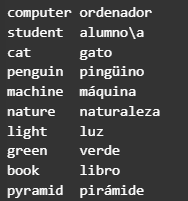

## EJERCICIO 3

Escribe un programa que muestre por pantalla 10 palabras en inglés junto a su correspondiente traducción al castellano. Las palabras deben estar distribuidas en dos columnas y alineadas a la izquierda.

Ejemplo: 
